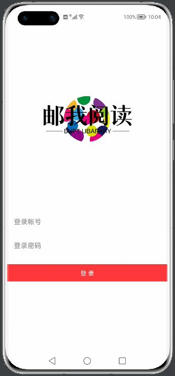
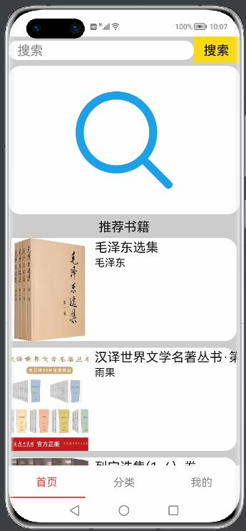
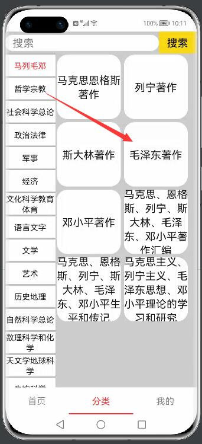
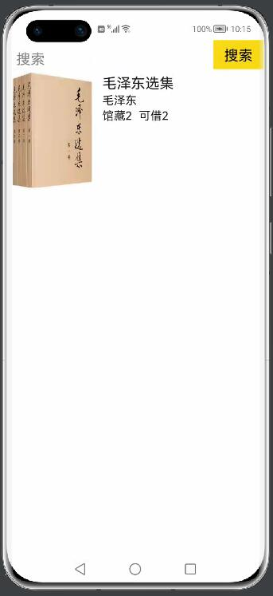
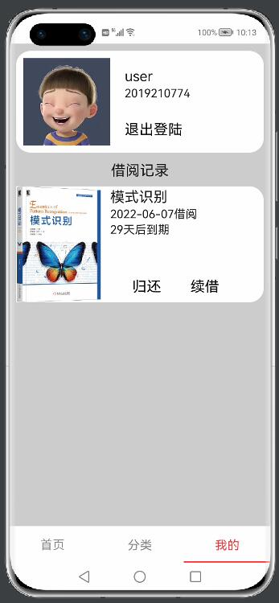
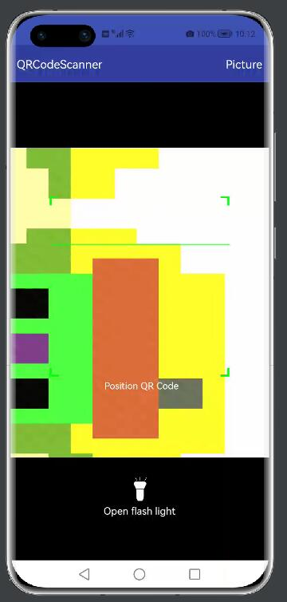

# 项目说明——邮我阅读
本项目名称为“邮我阅读”，是一个鸿蒙移动端应用程序。实现了一个小型的图书馆系统。

其对应的服务端源码：[https://github.com/leeshy-tech/lab_back_end](https://github.com/leeshy-tech/lab_back_end)

## 来源
本项目来源于BUPT课程“信息系统设计”  

进一步开发参与了“智能移动终端开发应用课程设计”的验收

## 项目功能
### 登陆页面
输入账号密码进行登陆

### 首页
- 搜索栏：进行关键字搜索，跳转到搜索结果页。
- 扫码按钮：点击扫描二维码进行书籍借阅。
- 推荐书籍
- 上拉加载和下拉刷新

### 分类页
- 左侧一级分类
- 右侧二级分类
- 点击二级分类跳转到该分类书籍列表页

### 个人页
- 个人信息、退出登陆
- 借阅记录：归还、续借、跳转到书籍信息页

### 书籍列表页
- 展示关键字搜索的结果
- 展示二级分类的结果

### 扫码页
- 调用相机扫描二维码借阅书籍
- 上传二维码图片

## 如何运行此项目
### 服务端
服务端程序需要运行在一个具有公网IP的主机上

本人使用的是腾讯云的ubuntu服务器，也可以使用家庭网络+内网穿透等技术

总之确保主机IP能被访问：使用`ping <IP>`命令测试

开放端口port（服务器防火墙，具体操作请自行Google解决）

运行服务端程序：[https://github.com/leeshy-tech/lab_back_end](https://github.com/leeshy-tech/lab_back_end)
### 移动端
- 克隆本仓库源码到本地，使用DevEco Studio打开。
- 更改entry模块中utils.Data中的IP和port，与服务端对应。
- 建议使用P40 Pro 远程模拟器运行此项目。
### 登陆
默认有两个账号：
- id=2019210774,pwd=lisai
- id=2019000774,pwd=admin

有其他需求在服务端代码中修改即可。
### 二维码扫描
二维码的文本信息格式：
`{"ISBN":"9787030254153","number":"0","operation":"借"}`

使用草料二维码等平台生成二维码

1. 使用实机调试，直接用相机扫码即可。
2. 使用模拟机测试，由于模拟机相机不可用，只能使用图片上传的方式扫码：
   1. 二维码图片生成链接url
   2. 在模拟机浏览器中访问该url
   3. 截图
   4. 返回应用上传图片
## 参考工程
1. 二维码扫描QRCodeScanner：[https://gitee.com/chinasoft_ohos/QRCodeScanner](https://gitee.com/chinasoft_ohos/QRCodeScanner)
2. 上拉加载与下拉刷新ZRefreshView：[https://gitee.com/yandeqing/ZRefreshView](https://gitee.com/yandeqing/ZRefreshView)
3. 锋迷商城fmmall：[https://www.bilibili.com/video/BV1DM4y1G7MN](https://www.bilibili.com/video/BV1DM4y1G7MN)